<h1 align="center">Herbalis</h1>

<p align="center"><em>Culture, séchage et consommation de substances pour serveur roleplay<br>
Paper/Purpur 1.21.11 — plantes 3D vivantes, réseau d'irrigation, qualité en étoiles.</em></p>

<p align="center">
  
  
  
  
</p>

<p align="center">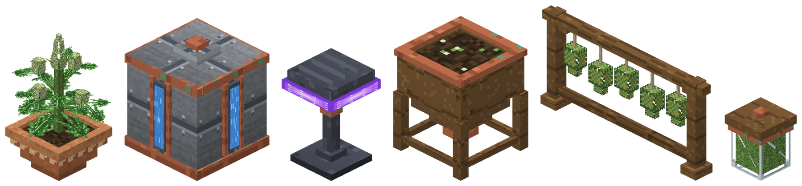</p>

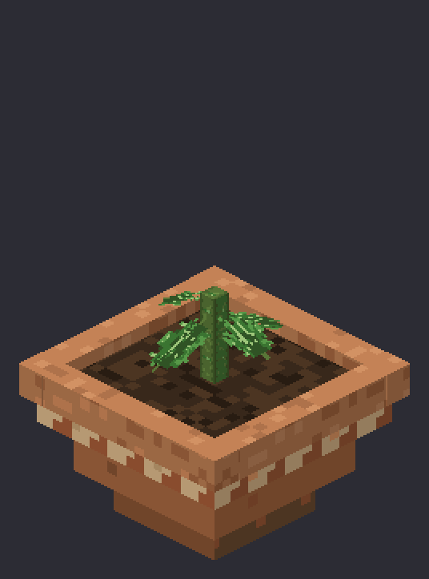

Scope v1 : la weed, sur une architecture multi-drogue (ajouter une
drogue = un fichier de config et des assets, zéro refonte).

Le plugin mise tout sur l'immersion : plantes sculptées en volumes 3D
(vraies feuilles de cannabis dentelées à 5-7 folioles, branches
latérales étagées aux stages avancés, colas à pistils) qui grandissent
en continu, se balancent et respirent doucement, chaque plant avec son
orientation et sa taille propres. Le terreau raconte le soin (humide,
sec et craquelé, fertilisé), les buds givrent de trichomes et
scintillent en fenêtre de récolte optimale, une feuille se détache
parfois des plants matures, des gouttes perlent après l'arrosage.
Arrosoir et joint en vrais models 3D en main, particules et sons sur
chaque action (fumée de joint en spirale), hologrammes d'état privés
au-dessus de ce que le joueur regarde (eau, terreau, qualité, alertes)
avec une font d'icônes dessinée pour le pack, effets de consommation
cinématiques (montée, plateau, descente, blackout), tolérance et
manque persistants.

Et de la profondeur de jeu : une culture au rythme d'une vraie plante
(environ une semaine réelle de la graine au joint, la croissance
continue chunk déchargé et serveur éteint), taille aux cisailles dans
une fenêtre précise, nuisibles à traiter au pulvérisateur,
goutte-à-goutte pour les cultivateurs peu présents, réseau
d'irrigation en tuyaux de cuivre (caissons d'eau en trois tailles,
silo d'engrais qui fertilise tout seul, tuyaux auto-connectés : pas
relié, pas d'eau), lampe horticole UV fullbright qui éclaire vraiment
les cultures d'intérieur, affinage en jarre de curing (avec
moisissure punitive), génétique des graines sur plusieurs
générations, joints à taffes qui se passent de main en main, toute la
pipeline craftable.

## Installation

1. Compiler le plugin et le resource pack :

   ```bash
   ./gradlew build packResourcePack
   ```

   Résultats :
   - `build/libs/Herbalis-1.0.0.jar`
   - `build/resourcepack/Herbalis-ResourcePack.zip`
   - `build/resourcepack/Herbalis-ResourcePack.sha1`

2. Déposer le jar dans `plugins/` du serveur Purpur 1.21.11.

3. Héberger le zip du resource pack (HTTP) et le déclarer dans
   `server.properties` :

   ```properties
   resource-pack=https://votre-domaine/Herbalis-ResourcePack.zip
   resource-pack-sha1=<contenu du fichier .sha1>
   require-resource-pack=true
   ```

4. Redémarrer. Le plugin crée `plugins/Herbalis/` avec `config.yml`,
   `messages.yml`, `drugs/weed.yml` et la base SQLite `herbalis.db`.

Aucune dépendance externe : pas d'ItemsAdder, Oraxen ou Nexo. Le driver
SQLite est déclaré dans `plugin.yml` (section `libraries`) et téléchargé
par le serveur au premier démarrage.

## De la graine au joint

<p align="center">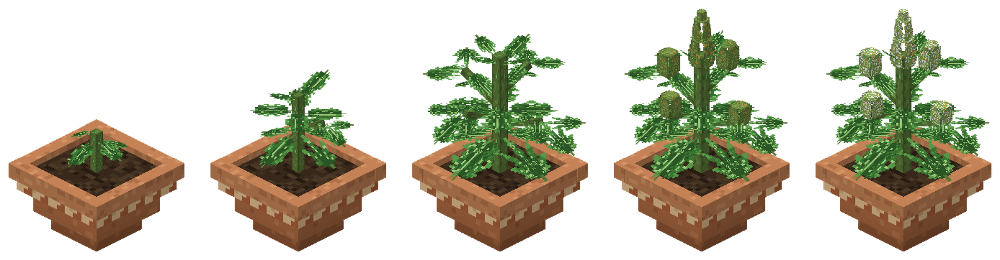</p>
<p align="center"><sub>Les 4 stages de croissance, puis la variante givrée de la fenêtre de récolte optimale.</sub></p>

1. **Poser un pot de culture** : clic droit avec le pot sur une surface
   solide. Le pot est une entité 3D, pas un bloc vanilla détourné.
2. **Planter une graine** : clic droit sur le pot avec une graine de
   weed. La pousse apparaît avec une petite animation de scale.
3. **Entretenir** : lumière, eau, engrais, nuisibles, taille — tout le
   détail dans [L'entretien](#lentretien) ci-dessous.
4. **Croissance** : 4 stages (pousse, jeune plant, plant mature, plant
   en fleur), environ 4 jours réels jusqu'à la floraison par défaut,
   transitions animées par interpolation. La croissance suit le temps
   réel : chunk déchargé ou serveur éteint, la plante rattrape tout
   son retard au retour (elle continue aussi de boire, revenez
   l'arroser). Une plante en extérieur pousse au rythme du soleil,
   rattrapage compris ; une serre éclairée pousse en continu.
   Regarder la plante fait flotter un hologramme d'état au-dessus
   d'elle, visible de vous seul : nom et stage, eau, terreau (humide,
   sec, fertilisé), qualité potentielle en étoiles et alertes
   contextuelles. Pots vides, racks et jarres ont le leur.
5. **Récolter** : au stade final, clic droit main vide (ou aux
   cisailles). Une fenêtre optimale de 12 heures s'ouvre à la
   floraison : les buds givrent de trichomes blancs et la plante
   scintille. Récolter dedans maximise la qualité, après elle décline.
   La qualité (1 à 5 étoiles) combine hydratation moyenne, engrais,
   timing de récolte et génétique de la graine. La récolte rend aussi
   **2 ou 3 graines héritées** : la plupart gardent les étoiles de la
   plante mère, certaines dérivent d'une étoile. On sélectionne sa
   lignée au fil des générations.
6. **Sécher, affiner** : rack de séchage puis jarre de curing — voir
   [Séchage et curing](#séchage-et-curing).
7. **Conditionner** : pochon vide en main, clic droit : la meilleure
   weed séchée de l'inventaire est emballée, qualité héritée.
8. **Rouler** : pochon + feuille à rouler dans une grille de craft
   (établi ou inventaire) = joint, qualité héritée.
9. **Fumer et partager** : un joint contient 3 taffes (configurable).
   Maintenir clic droit fume une taffe : braise à l'allumage, fumée
   visible par tous, montée en 15 secondes par paliers avec messages
   d'ambiance, plateau avec buffs (durée et intensité selon la
   qualité : 2 minutes à 1 étoile, 6 minutes à 5 étoiles), descente
   systématique (lenteur, faim, courte nausée). Le joint entamé
   revient en main avec ses taffes restantes au lore. Clic droit sur
   un joueur : on lui **passe le joint**, directement dans sa main
   libre, messages des deux côtés. Tolérance, addiction et blackout
   se comptent par taffe : un joint entier fumé seul et vite, c'est
   déjà flirter avec le blackout.

### L'entretien

<p align="center">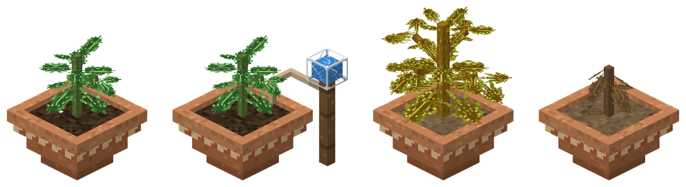</p>
<p align="center"><sub>Terreau fertilisé, goutte-à-goutte installé, plante à sec qui jaunit, plante morte.</sub></p>

- **Lumière** : niveau 12 minimum (configurable), sinon la croissance
  est figée et le HUD l'indique. Une serre éclairée pousse la nuit.
- **Arrosage** : l'hydratation baisse avec le temps (la jauge pleine
  tient environ une journée : comme une vraie plante, elle s'arrose
  une à deux fois par jour). Arrosoir en main, clic droit sur la
  plante. L'arrosoir a 8 charges et se recharge d'un clic droit sur
  un bloc d'eau. Une plante à sec arrête de pousser, jaunit (6 h),
  puis meurt (24 h de plus, le pot reste) : environ deux jours de
  négligence lui sont fatals.
- **Engrais** : un par stage, accélère le stage en cours et améliore
  la qualité potentielle.
- **Goutte-à-goutte (craftable)** : installé sur le pot (petit
  réservoir sur piquet, visible), il divise la perte d'eau par deux.
  Rendu en cassant le pot.
- **Nuisibles** : une plante établie peut s'infester (moucherons
  visibles, alerte à l'hologramme). Infestée, elle pousse deux fois
  moins vite ; ignorée 12 h, elle est abîmée (-1 étoile à la récolte,
  définitif). Le pulvérisateur craftable la traite en un clic et se
  recharge sur l'eau.
- **Taille (topping)** : un coup de cisailles (l'outil vanilla) aux
  stages 2 ou 3, dans la fenêtre du milieu de stage (le HUD affiche
  des ciseaux quand c'est le moment) : +1 à 2 têtes à la récolte,
  mais la plante encaisse la coupe et perd quelques heures de
  progression. Hors fenêtre, la coupe abîme la plante (-1 étoile).
  Une seule taille par plante, et les cisailles s'usent (durabilité
  vanilla, configurable).

### Le réseau d'irrigation

<p align="center">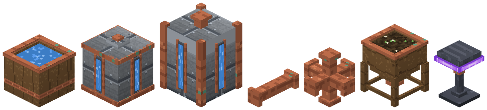</p>
<p align="center"><sub>Cuve (16 seaux), citerne (64), réservoir industriel (256), tuyaux de cuivre, silo d'engrais, lampe horticole UV.</sub></p>

- **Caissons d'eau** : cuve, citerne et réservoir (16, 64 et
  256 seaux, configurables) se remplissent au seau et abreuvent
  automatiquement les pots qui leur sont **reliés par des tuyaux de
  cuivre**. Pas relié, pas d'eau. Le niveau d'eau se lit sur le
  caisson (cuve ouverte, jauges des citernes). Un pot relié ne
  demande plus d'arrosoir tant que le réseau a du stock : environ un
  seau par plante et par jour, deux fois moins avec un
  goutte-à-goutte. L'hologramme de la plante affiche « reliée au
  réseau » ou « réseau à sec », celui du caisson son stock et ses
  pots reliés.
- **Tuyaux** : se posent sur n'importe quelle face (même en l'air) et
  se connectent visuellement entre eux et aux caissons, silos et pots
  (64 models générés, un par combinaison de voisins).
- **Silo d'engrais** : chargé en doses d'engrais (16 par défaut), il
  fertilise tout seul chaque nouveau stage des plantes reliées au
  réseau. Cassé, il rend ses doses.
- **Lampe horticole UV** : lueur violette (halo de particules,
  panneau LED fullbright visible de nuit) et vraie lumière niveau
  15 : les caves deviennent des serres, croissance nocturne et
  rattrapage compris.

### Séchage et curing

<p align="center">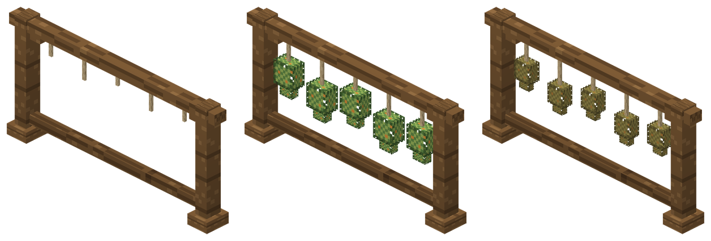</p>
<p align="center"><sub>Rack vide, chargé de têtes fraîches, têtes sèches prêtes.</sub></p>

- **Sécher** : poser un rack de séchage, y suspendre jusqu'à 6 têtes
  fraîches (clic droit). Un jour en temps réel, le séchage continue
  serveur éteint. Le modèle du rack change selon son état et des
  particules discrètes signalent de loin qu'il est prêt. Retirer trop
  tôt (sneak + clic droit) coûte de la qualité.

<p align="center">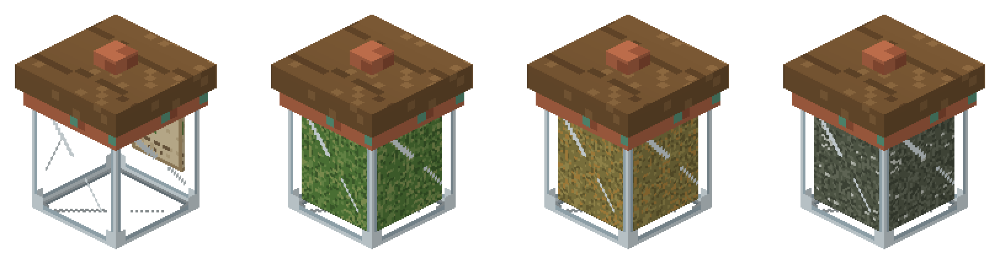</p>
<p align="center"><sub>Jarre vide, affinage en cours, weed affinée (+1 étoile), jarre moisie.</sub></p>

- **Affiner (curing, optionnel)** : déposer la weed séchée dans une
  jarre de curing (jusqu'à 6 têtes, contenu visible à travers le
  verre). Deux jours en temps réel (continue serveur éteint) :
  +1 étoile. Mais une jarre oubliée moisit deux jours après la fin
  d'affinage : tout le contenu est ruiné (1 étoile), et une seule
  tête moisie contamine la jarre entière.

### Abus, tolérance, manque

- **Blackout** : 7 taffes en moins de 10 minutes (plus de deux joints
  entiers à soi tout seul) : écran noir, joueur cloué au sol
  30 secondes, caméra qui tangue, réveil vaseux.
- **Tolérance** : monte à chaque joint, décroît en temps réel (même
  hors ligne). Haute tolérance = effets plus courts et plus faibles.
- **Addiction** : consommer régulièrement rend addict. Sans dose,
  symptômes périodiques (tremblements, nausée brève, battements de
  coeur, messages d'ambiance). Tenir assez longtemps fait retomber
  l'addiction.

## Items et crafts

Toute la pipeline se craft avec des matériaux vanilla, sauf les
graines (récolte, casse de plante ou `/herbalis give` uniquement).

| | Item | Craft | Usage |
| :---: | --- | --- | --- |
| 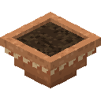 | Pot de culture | 7 briques (forme pot) | Se pose au sol, socle de la plante |
| 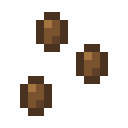 | Graine de weed | Pas de craft : récolte ou give | Clic droit sur un pot, porte sa lignée (étoiles) |
| 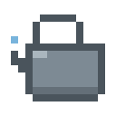 | Arrosoir | 1 pépite (bec) + 4 lingots de fer | Arrose (8 charges), se recharge sur l'eau |
|  | Cisailles | Craft vanilla (2 lingots de fer) | Taille aux stages 2-3, usure vanilla configurable |
| 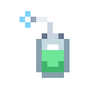 | Pulvérisateur | 1 pépite + 1 lingot + 1 fiole (colonne) | Traite les nuisibles (6 charges), se recharge sur l'eau |
| 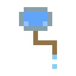 | Goutte-à-goutte | 3 verres + 1 bâton + 1 ficelle | S'installe sur un pot, perte d'eau divisée par deux |
| 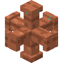 | Tuyau d'irrigation | 3 lingots de cuivre (x4) | Relie caissons, silos et pots ; se pose partout |
| 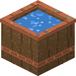 | Cuve d'eau | 4 lingots de cuivre + 5 planches | Caisson de 16 seaux, niveau d'eau visible |
| 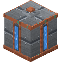 | Citerne d'eau | 8 lingots de fer + 1 seau | Caisson de 64 seaux, jauges en façade |
| 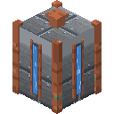 | Réservoir industriel | 4 blocs de fer + 4 lingots + 1 seau | Caisson de 256 seaux, plus haut qu'un bloc |
| 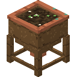 | Silo d'engrais | 7 planches + 1 entonnoir | Fertilise tout seul les pots reliés (16 doses) |
| 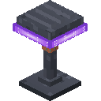 | Lampe horticole UV | 3 améthystes + 2 verres + 1 redstone + 1 lingot | Vraie lumière niveau 15, panneau violet fullbright |
| 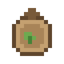 | Engrais naturel | 2 poudres d'os + 1 terre (x2) | Un par stage, boost vitesse et qualité |
| 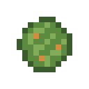 | Tête fraîche | Récolte | Se suspend au rack de séchage |
| 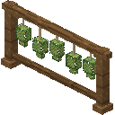 | Rack de séchage | 3 bâtons + 3 ficelles + 2 bâtons | Sèche jusqu'à 6 têtes |
| 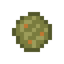 | Weed séchée | Rack | Se conditionne en pochon, ou s'affine en jarre |
| 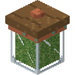 | Jarre de curing | 5 verres + 1 dalle de chêne | Affine la weed séchée (+1 étoile, gare à la moisissure) |
| 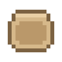 | Pochon vide | 1 cuir + 1 ficelle (x2) | Clic droit pour emballer la weed séchée |
| 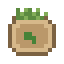 | Pochon de weed | Conditionnement | Ingrédient du joint |
|  | Feuille à rouler | 1 papier + 1 canne à sucre (x3) | Ingrédient du joint |
|  | Joint | Pochon + feuille à rouler | 3 taffes : se fume, se passe (clic droit sur un joueur) |

Casser une plante (clic gauche) rend une graine de sa lignée
(configurable). Casser un pot, un rack ou une jarre (clic gauche) rend
l'item ; pleins, ils rendent d'abord leur contenu.

## Commandes

| Commande | Permission | Description |
| --- | --- | --- |
| `/herbalis give <joueur> <item> [quantité] [qualité]` | `herbalis.admin` | Donne un item Herbalis (qualité 1 à 5, graines incluses) |
| `/herbalis info` | `herbalis.info` | Détails de la plante, du rack ou de la jarre regardés |
| `/herbalis avance <durée>` | `herbalis.admin` | Avance le temps de la cible regardée (ex : `6h`, `2d`) : indispensable pour tester la pipeline à l'échelle réelle |
| `/herbalis tolerance <joueur> [reset]` | `herbalis.admin` | Consulte ou remet à zéro tolérance et addiction |
| `/herbalis reload` | `herbalis.admin` | Recharge config, messages et drogues |

Tab completion complète sur tout. Alias : `/herb`.

Items pour `give` : `pot`, `drying_rack`, `curing_jar`, `watering_can`,
`sprayer`, `dripper`, `pipe`, `tank_cuve`, `tank_citerne`,
`tank_reservoir`, `silo`, `uv_lamp`, `fertilizer`, `rolling_paper`,
`pouch_empty`, `weed_seed`, `weed_bud_fresh`, `weed_dried`,
`weed_pouch`, `weed_joint`. La taille se fait aux cisailles vanilla.

## Permissions

| Permission | Défaut | Portée |
| --- | --- | --- |
| `herbalis.plant` | tous | Poser pots et racks, planter, entretenir, casser |
| `herbalis.harvest` | tous | Récolter, sécher, conditionner |
| `herbalis.consume` | tous | Fumer |
| `herbalis.info` | op | `/herbalis info` |
| `herbalis.admin` | op | Toutes les commandes d'administration |

## Configuration

- `config.yml` : tick de croissance, autosave, particules et sons,
  hologrammes (activation, portée du regard), charges de l'arrosoir
  et du pulvérisateur, facteur du goutte-à-goutte, irrigation (points
  d'eau par seau, capacité de chaque taille de caisson), capacité du
  silo, niveau de lumière de la lampe UV, usure des cisailles à la
  taille, drops, explosions, cadence du manque. Tout est commenté en
  français.
- `drugs/weed.yml` : la définition complète de la weed : durées de
  stages, lumière minimum, hydratation, engrais, fenêtre de récolte,
  séchage, taille (stages, fenêtre, bonus, malus), nuisibles
  (chance, ralentissement, délai de dégâts, malus), curing (durée,
  moisissure, bonus), effets (montée, plateau, descente), taffes par
  joint, blackout, tolérance, addiction, poids du calcul de qualité
  (dont la génétique). Les durées acceptent `30s`, `8m`, `1h30m`,
  `2d` ou `1j12h` ; les défauts visent le rythme d'une vraie culture
  (environ une semaine de la graine au joint), tout se raccourcit
  pour un serveur au rythme arcade. Les sections `taille`, `curing`
  et `nuisibles` sont optionnelles : une config antérieure reste
  valide (défauts raisonnables, nuisibles désactivés et génétique à
  0 tant qu'ils ne sont pas déclarés).
- `messages.yml` : 100 % des textes joueur, en MiniMessage.

### Ajouter une drogue

1. Dupliquer `drugs/weed.yml` en `drugs/<id>.yml` et ajuster.
2. Ajouter les assets au resource pack : `<id>_seed`, `<id>_bud_fresh`,
   `<id>_dried`, `<id>_pouch`, `<id>_joint` (items), et les models
   `plant_<id>_stage_1` à `4`, variantes `_dry` (stages 2 à 4), la
   variante `_prime` du stade final (buds givrés, fenêtre optimale) et
   `plant_<id>_dead`.
3. `/herbalis reload`. Aucun code à toucher.

Note v1 : la tolérance et l'addiction sont un profil unique par joueur,
partagé entre drogues.

## Architecture

```
domain/          Métier pur, zéro import Bukkit, testé unitairement :
                 Plant, GrowthEngine, Quality, DryingRack, CuringJar,
                 DrugType, ConsumptionEngine (tolérance, blackout,
                 manque)
application/     Cas d'usage (PlantSeed, Water, Harvest, Consume...)
                 et ports (repositories, environnement)
infrastructure/  Bukkit : rendu Item Display + Interaction, SQLite
                 (écriture asynchrone, write-behind), tickers globaux,
                 listeners, commandes, FX, hologrammes d'état
```

Choix techniques notables :

- **Pas de bloc vanilla détourné** : pots, plantes et racks sont des
  Item Display + Interaction. Aucun barrel ni note block sacrifié, et
  les emplacements sont protégés (blocs, eau, pistons, explosions).
- **Entités jetables, base souveraine** : les Display sont non
  persistantes, respawnées au chargement des chunks depuis SQLite, les
  orphelines sont purgées. Un crash ne laisse aucun fantôme.
- **Un scheduler global par préoccupation** (croissance, racks,
  joueurs, hologrammes, autosave), jamais une task par plante.
- **Hologrammes privés** : un TextDisplay par joueur, invisible pour
  les autres (`setVisibleByDefault(false)` + `showEntity`), qui suit
  la cible du regard et se retire dès qu'on détourne les yeux.
- **Timestamps, pas des ticks comptés** : séchage, curing, tolérance,
  addiction et sessions d'effets survivent aux redémarrages et aux
  déconnexions. La croissance aussi : chaque plante garde la date de
  son dernier tick et rattrape son retard par tranches au retour du
  chunk, si bien qu'une absence de trois jours se simule fidèlement
  (assoiffement, passages de stage, mort) en une fraction de seconde.
- **Composants 1.21.x** : `item_model` (pas de custom_model_data
  legacy), `consumable` pour l'animation de fumage, `max_damage` pour
  la jauge de l'arrosoir.

## Resource pack

Structure dans `resourcepack/`, format 75 (1.21.11).

- Plantes sculptées en éléments : tige en volume, feuilles de cannabis
  dentelées à 5-7 folioles (deux silhouettes alternées, nervure claire,
  atlas 64x), rosettes au sol et, aux stages 3-4, branches latérales
  inclinées asymétriques portant bouquets de feuilles et colas à
  pistils, cola apical segmenté au stade final, variante givrée de
  trichomes pendant la fenêtre de récolte optimale. Pot conique par
  étages avec trois terreaux (humide, sec, fertilisé), rack avec
  bouquets suspendus en volume qui se resserrent en séchant. Textures
  32x pour les blocs, 16x pour les items (cohérence vanilla en
  inventaire).
- Arrosoir et joint : models 3D en main et au sol, sprite 2D en
  inventaire (select sur le contexte d'affichage, 1.21.4+).
- Goutte-à-goutte en vrai volume sur le pot (piquet, réservoir en
  verre plein d'eau, tuyau qui plonge dans le terreau, variantes des
  trois terreaux), sprites 16x du pulvérisateur et du goutte-à-goutte.
- Réseau d'irrigation : **64 models de tuyaux générés par masque de
  connexions** (un par combinaison des six voisins, colliers de
  raccord aux jonctions), caissons en trois tailles et quatre niveaux
  d'eau chacun (cuve en douves ouverte où l'eau se voit, citerne et
  réservoir rivetés à jauges en façade, montants de cuivre), silo à
  trémie sur pieds (contenu visible : vide, entamé, plein), lampe
  horticole (panneau LED violet rendu fullbright via la brightness du
  Display, plus un vrai bloc `minecraft:light` posé par le plugin).
- Font d'icônes `herbalis:icons` (feuille, goutte, terreau, étoiles,
  segments, soleil, ciseaux, sablier, coche...) : glyphes blancs
  teintés par les balises de couleur MiniMessage, utilisés dans les
  hologrammes et messages.yml.
- Les textures sont générées par `resourcepack/tools/generate_textures.py`
  (Pillow) et les models par `generate_models.py` ; les chemins et les
  régions UV sont stables pour permettre à un artiste de remplacer les
  PNG sans toucher aux models.
- `preview_render.py` rend n'importe quel model en isométrique sans
  lancer le jeu (z-buffer, ombrage par face, conventions de rotation du
  jeu) : idéal pour itérer sur les models. `readme_shots.py` s'appuie
  dessus pour générer toutes les images de ce README (`docs/img/`),
  planches et icônes comprises.

```bash
cd resourcepack/tools
python3 -m venv .venv && .venv/bin/pip install pillow
.venv/bin/python generate_textures.py
.venv/bin/python generate_models.py
.venv/bin/python preview_render.py --all -o /tmp/previews
.venv/bin/python readme_shots.py
```

`./gradlew packResourcePack` zippe le pack et écrit son SHA-1.

## Tests

```bash
./gradlew test
```

78 tests unitaires sur le domaine et les cas d'usage : progression de
croissance, rattrapage hors ligne (stages, mort au bon moment, chunk
déchargé, rythme jour/nuit sous ciel, goutte-à-goutte), lumière,
sécheresse et mort, nuisibles (apparition, ralentissement, dégâts,
traitement), réseau d'irrigation (BFS des tuyaux, coupures, stocks
des caissons, panne sèche en plein rattrapage, partage entre pots,
fertigation une dose par stage), calcul de qualité (dont génétique,
malus de taille et de nuisibles), malus de séchage, curing (affinage,
moisissure, contamination), fenêtre de taille, graines héritées,
tolérance, fenêtre de blackout, seuils de manque, chronologie des
effets, parsing des durées (jours inclus).
